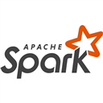

# Spark Performance Optimization

<p align="center">
	
</p>

Analyze Apache Spark event logs locally and install a guided GitHub Copilot skill for iterative performance work in OSS Spark, Azure Synapse, and Databricks.

## Features

- Analyze raw Spark event logs, event-log directories, gzip files, and ZIP archives.
- Inspect application overview, executors, ramp-up, stages, skew, shuffle, spill, output, speculation, SQL executions, and physical plans.
- Compare baseline and candidate event logs with the bundled command-line analyzer.
- Install or update the bundled `spark-perf-optimization` personal Copilot skill atomically.
- Keep analysis local. The extension does not upload event logs or call an independent model service.

## Requirements

- VS Code 1.96 or newer.
- Python 3.10 or newer available as `python`, `python3`, or through the `sparkPerf.pythonPath` setting.
- GitHub Copilot Chat for the guided skill workflow. The event-log analyzer works without Copilot.

The analyzer uses only the Python standard library.

## Getting Started

### Analyze one event log

This path runs locally and does not require GitHub Copilot Chat.

1. Install **Spark Performance Optimization** from the VS Code Marketplace.
2. Open the folder that contains your Spark event log in VS Code.
3. Open the Command Palette with **Ctrl+Shift+P** on Windows/Linux or **Cmd+Shift+P** on macOS.
4. Type and select **Spark Perf: Analyze Spark Event Log**.
5. Select a raw event log, `.json`, `.eventlog`, `.gz`, or `.zip` file.
6. Wait for the analysis to finish. Results appear in **View > Output**.
7. In the Output panel's channel list, select **Spark Performance Optimization**.

The first analysis automatically installs the bundled analyzer and Copilot skill. Reload VS Code if prompted.

### Use the guided Copilot skill

Use this path when you want Copilot to interpret results, diagnose a bottleneck, compare runs, or guide an optimization round.

1. Open the Command Palette.
2. Run **Spark Perf: Install/Update Spark Performance Skill**.
3. Select **Reload** in the installation notification.
4. Open GitHub Copilot Chat and choose **Agent** mode.
5. Ask Copilot to use the skill and include the event-log path and your goal. For example:

	> Use the spark-perf-optimization skill to analyze `C:\logs\baseline.zip`, identify the main bottleneck, and recommend one evidence-backed next change.

For a comparison, use a prompt such as:

> Use the spark-perf-optimization skill to compare `C:\logs\baseline.zip` with `C:\logs\candidate.zip` and summarize wall-time, executor, skew, and spill changes.

The skill is selected from the request context; there is no separate slash command to run.

### Use the command-line analyzer

1. Open the Command Palette.
2. Run **Spark Perf: Open CLI Terminal**.
3. Run the commands below in the **Spark Perf CLI** terminal that opens. Quote paths containing spaces.

```powershell
# Complete analysis of one event log
python scripts/spark_eventlog_analyze.py all "C:\logs\application.eventlog"

# Quick application summary
python scripts/spark_eventlog_analyze.py overview "C:\logs\application.eventlog"

# Compare a baseline with a candidate run
python scripts/spark_eventlog_analyze.py compare overview "C:\logs\baseline.zip" "C:\logs\candidate.zip"

# List every command and option
python scripts/spark_eventlog_analyze.py --help
```

On macOS or Linux, use `python3` instead of `python` when that is how Python 3.10+ is installed.

## Commands

| Command | Purpose |
|---|---|
| `Spark Perf: Analyze Spark Event Log` | Select a log and run the complete local analysis. |
| `Spark Perf: Open CLI Terminal` | Open a terminal in the installed skill directory and show analyzer help. |
| `Spark Perf: Install/Update Spark Performance Skill` | Install or update the bundled personal Copilot skill. Reload VS Code afterward. |
| `Spark Perf: Uninstall Spark Performance Skill` | Remove the skill installed by this extension. |

## Configuration

The extension automatically tries `python` on Windows and `python3` on macOS/Linux. To use a different Python executable:

1. Open VS Code Settings with **Ctrl+,** on Windows/Linux or **Cmd+,** on macOS.
2. Search for **Spark Performance Optimization: Python Path**.
3. Enter the full path to a Python 3.10+ executable, such as `C:\Python312\python.exe`.

You can also set `sparkPerf.pythonPath` directly in `settings.json`. Leave it empty for automatic discovery.

## Privacy and Security

Spark event logs can contain application names, storage paths, SQL plans, schemas, user identifiers, and literals. The extension processes selected files locally and does not add them to source control. Treat analyzer output and generated reports as sensitive until reviewed and sanitized.

ZIP input is streamed without extraction. The analyzer rejects encrypted entries, suspicious compression ratios, archives with excessive entries, and archives whose declared expanded size exceeds its safety limit.

## Limitations

- HTTP storage errors and driver-only failures may require driver or platform logs in addition to the Spark event log.
- Recommendations are evidence-driven starting points, not universal Spark configuration defaults.
- Cost estimates require an approved rate, active executor lifetimes, run cadence, and clearly stated assumptions.

## Support

See [SUPPORT.md](SUPPORT.md) for issue-reporting guidance. Source and issue tracking are hosted at https://github.com/nk2242696/spark-perf-optimization.

## License

MIT
